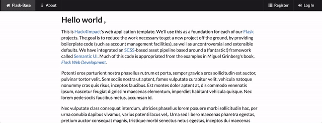
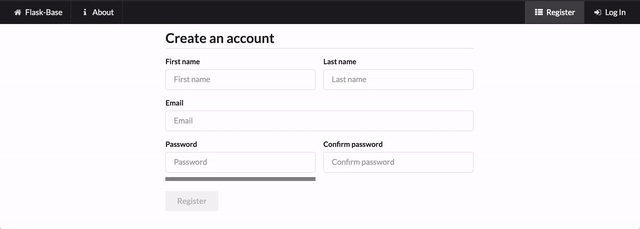
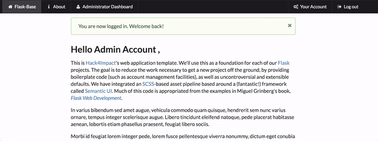
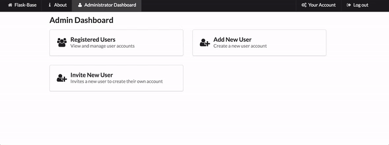

# flask-base
[](https://circleci.com/gh/hack4impact/flask-base) 
[](https://codeclimate.com/github/hack4impact/flask-base/coverage)
[](https://codeclimate.com/github/hack4impact/flask-base)   


A Flask application template with the boilerplate code already done for you.


**Documentation available at [http://hack4impact.github.io/flask-base](http://hack4impact.github.io/flask-base).**

## What's included?

* Blueprints
* User and permissions management
* Flask-SQLAlchemy for databases
* Flask-WTF for forms
* Flask-Assets for asset management and SCSS compilation
* Flask-Mail for sending emails
* gzip compression
* Redis Queue for handling asynchronous tasks
* ZXCVBN password strength checker
* CKEditor for editing pages

## Demos

Home Page:



Registering User:



Admin Editing Page:



Admin Editing Users:




## Setting up

##### Create your own repository from this Template

Navigate to the [main project page](https://github.com/hack4impact/flask-base) and click the big, green "Use this template" button at the top right of the page. Give your new repository a name and save it.

##### Clone the repository 

```
$ sudo git clone https://github.com/voytecPL/roadrunners.git
$ sudo chown -R ubuntu:ubuntu /srv/www/roadrunners/
$ cd roadrunners
```

requirements.txt
psycopg2==2.8.3 => psycopg2==2.8.4

##### Installing dependencies

$ apt-get install python3-venv
$ sudo apt-get install redis-server
$ sudo apt-get install libpq-dev
$ pip3 install wheel

sudo apt-get install python3-pip

sudo apt-get install ruby-full build-essential rubygems

##### Initialize a virtual environment

Ubuntu 20.04:
```
$ sudo python3 -m venv venv
$ source venv/bin/activate
```
##### Add Environment Variables

Create a file called `config.env` that contains environment variables. **Very important: do not include the `config.env` file in any commits. This should remain private.** You will manually maintain this file locally, and keep it in sync on your host.

Variables declared in file have the following format: `ENVIRONMENT_VARIABLE=value`. You may also wrap values in double quotes like `ENVIRONMENT_VARIABLE="value with spaces"`.

1. In order for Flask to run, there must be a `SECRET_KEY` variable declared. Generating one is simple with Python 3:

   ```
   $ python3 -c "import secrets; print(secrets.token_hex(16))"
   ```

   This will give you a 32-character string. Copy this string and add it to your `config.env`:

   ```
   SECRET_KEY=Generated_Random_String
   ```

2. The mailing environment variables can be set as the following.
   We recommend using [Sendgrid](https://sendgrid.com) for a mailing SMTP server, but anything else will work as well.

   ```
   MAIL_USERNAME=SendgridUsername
   MAIL_PASSWORD=SendgridPassword
   ```

Other useful variables include:

| Variable        | Default   | Discussion  |
| --------------- |-------------| -----|
| `ADMIN_EMAIL`   | `flask-base-admin@example.com` | email for your first admin account |
| `ADMIN_PASSWORD`| `password`                     | password for your first admin account |
| `DATABASE_URL`  | `data-dev.sqlite`              | Database URL. Can be Postgres, sqlite, etc. |
| `REDISTOGO_URL` | `http://localhost:6379`        | [Redis To Go](https://redistogo.com) URL or any redis server url |
| `RAYGUN_APIKEY` | `None`                         | API key for [Raygun](https://raygun.com/raygun-providers/python), a crash and performance monitoring service |
| `FLASK_CONFIG`  | `default`                      | can be `development`, `production`, `default`, `heroku`, `unix`, or `testing`. Most of the time you will use `development` or `production`. |


##### Install the dependencies

```
$ pip3 install -r requirements.txt
```

##### Other dependencies for running locally

You need [Redis](http://redis.io/), and [Sass](http://sass-lang.com/). Chances are, these commands will work:

**Sass:**

$ sudo apt-get install ruby-full build-essential rubygems
$ sudo gem install sass

or

$ sudo apt-get install -y sass

**Redis:**

 [Optional]
 **PostgresQL**

_Linux (based on this [issue](https://github.com/hack4impact/flask-base/issues/96)):_

```
sudo apt-get install libpq-dev
```


##### Create the database

```
$ python3 manage.py recreate_db
```

##### Other setup (e.g. creating roles in database)

```
$ python3 manage.py setup_dev
```

Note that this will create an admin user with email and password specified by the `ADMIN_EMAIL` and `ADMIN_PASSWORD` config variables. If not specified, they are both `flask-base-admin@example.com` and `password` respectively.

##### [Optional] Add fake data to the database

```
$ python3 manage.py add_fake_data
```

### Running with Gunicorn

```
$ gunicorn -b 0.0.0.0:8000 -w 4 manage:app
```

## Running the app

```
$ source env/bin/activate

DEBUG
$ honcho start -e config.env -f Local

PROD
$ honcho start -e config.env
```

## Databse

```
$ python manage.py db init
$ python manage.py db migrate
$ python manage.py db upgrade
```

## Getting up and running with supervisor

Page is avaialble at: <https://roadrunners.jakubas.eu/>
WiFi/LAN connection: <http://192.168.0.14:8000/>

Configuring hosting:

* sudo apt -y install supervisor

/etc/supervisor/conf.d
sudo nano /etc/supervisor/conf.d/roadrunners.conf

```
[program:roadrunners]
command=/srv/www/roadrunners/venv/bin/gunicorn -b 0.0.0.0:8000 -w 4 manage:app
directory=/srv/www/roadrunners
user=ubuntu
autostart=true
autorestart=true
stopasgroup=true
killasgroup=true
```

* sudo supervisorctl reload
* sudo supervisorctl stop roadrunners
* sudo supervisorctl start roadrunners
* sudo supervisorctl status roadrunners

## Starting as group

```
[program:web-1]
command=/srv/www/roadrunners/venv/bin/gunicorn -b 0.0.0.0:8000 -w 4 manage:app
directory=/srv/www/roadrunners
user=ubuntu
autostart=true
autorestart=true
#stopasgroup=true
#killasgroup=true
stopsignal=QUIT
stdout_logfile=/var/log/roadrunners/web-1.log
stderr_logfile=/var/log/roadrunners/web-1.error.log

[program:worker-1]
command=/srv/www/roadrunners/venv/bin/python -u manage.py run_worker
directory=/srv/www/roadrunners
user=ubuntu
autostart=true
autorestart=true
stopsignal=QUIT
stdout_logfile=/var/log/roadrunners/worker-1.log
stderr_logfile=/var/log/roadrunners/worker-1.error.log

[group:roadrunners]
programs=web-1,worker-1
```

* sudo supervisorctl start roadrunners:*
* sudo supervisorctl restart roadrunners:*

## Gettin up and running with Docker

Currently we have a `Dockerfile` intended for testing purposes and it automates the whole cycle of running the application, setting up the database and redis. 


##### How to use the docker file 
In only three simple steps :
- change the variables `MAIL_USERNAME` , `MAIL_PASSWORD` and `SECRET_KEY`
- `docker build -t <image_name> . 
- `docker run -it -d -p 5000:5000 --name <container name> <image_name> /bin/bash`
- To run in foreground mode `docker run -it -p 5000:5000 --name <container name> <image_name> /bin/bash`

##### Note

A more robust version with docker-compose is being developed to separate redis in separate container and allow the deployment of production-level applications automatically without the need of manual provisioning

## Formatting code

Before you submit changes to flask-base, you may want to autoformat your code with `python manage.py format`.


## Contributing

Contributions are welcome! Please refer to our [Code of Conduct](./CONDUCT.md) for more information.

## Documentation Changes

To make changes to the documentation refer to the [Mkdocs documentation](http://www.mkdocs.org/#installation) for setup.

To create a new documentation page, add a file to the `docs/` directory and edit `mkdocs.yml` to reference the file.

When the new files are merged into `master` and pushed to github. Run `mkdocs gh-deploy` to update the online documentation.

## Related
https://medium.freecodecamp.com/how-we-got-a-2-year-old-repo-trending-on-github-in-just-48-hours-12151039d78b#.se9jwnfk5

## License
[MIT License](LICENSE.md)
